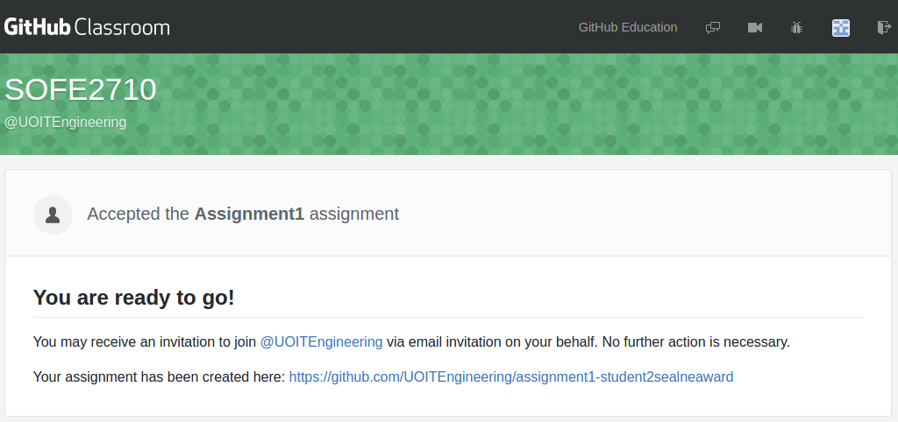
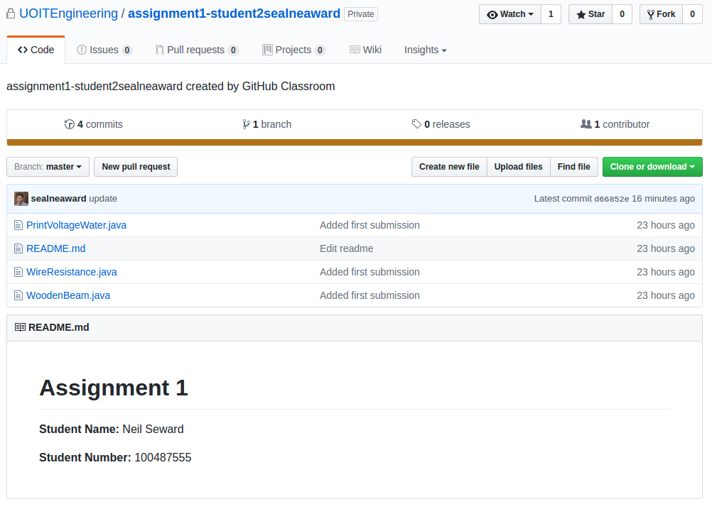
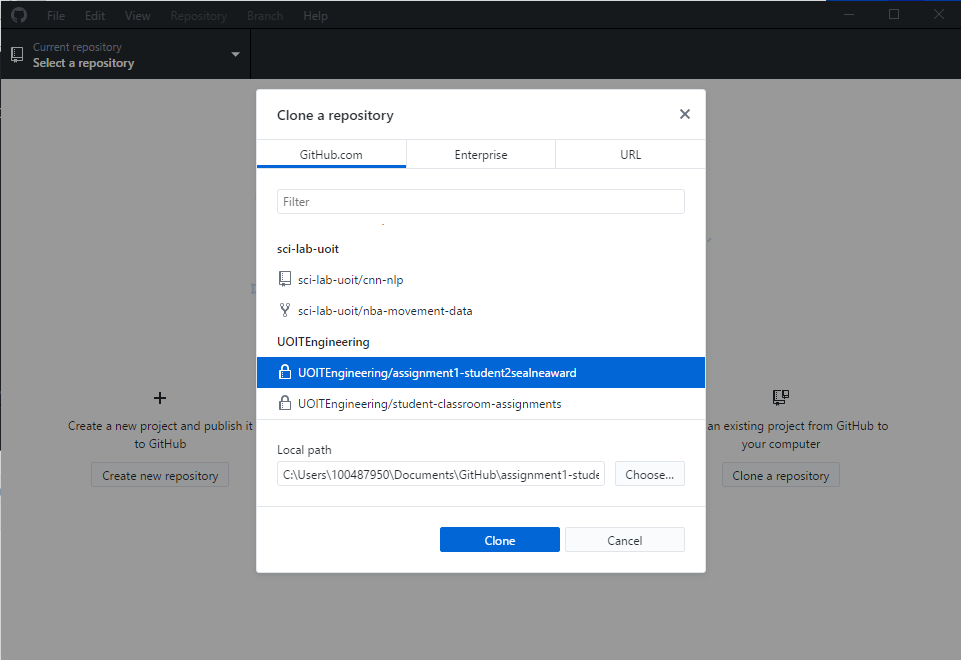
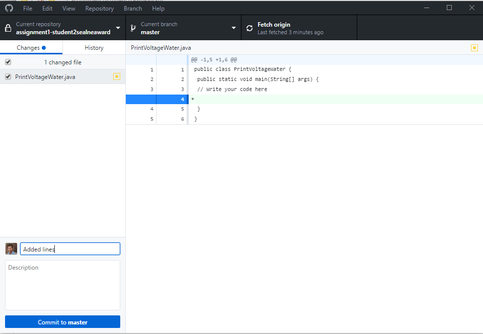

# student-classroom-assignments
Step-by-step process for UOIT students to access GitHub Classroom and create repositories for assignments.

# Setup

1. Sign into github.com and then classroom.github.com. You may be prompted to accept access rights for the Classroom application. Give access to GitHub Classroom.

2. Access the github classroom assignment link from the assignment page on blackboard.

3. Once you navigate to the assignment page, you should see a dropdown with all of the students in the classroom. Navigate to the correct ID/Name for you.

4. The next page will ask you to accept the assignment. Accept the assignment and you will see a response with all of your assignment repository information.

5. Navigate to your repository page. There will be a process to load the sample code. Your new repository should look like this.

# Using GitHub

GitHub is a valuable tool to keep track of your work and to give yourself a proper catalog for programming related job interviews. In git, there is a specific workflow to working on your code. At first, your **clone** your repository to create a copy on your local machine. After cloning, you **add** your changes to the local repository. Once the changes are added, you create **commits** that create timestamps of the changes made. After commits are made, you **push** the commits to the github.com repository.

### Setup

1. Download and install the dekstop gui for github on windows from [here](https://desktop.github.com/).

2. Login to the application. Once you are logged in, you can clone your repository from a dropdown of repositories that you have access to.

3. Add your changes to your code. You should only be adding raw code files that follow the structure of the initial starter code. Once you have made your changes inside of the local repository, you can now **create a commit and push**. Once you commit your changes to master, you will have an option to push the commit. You should be able to view the new changes on your repository on github.com once your push.

